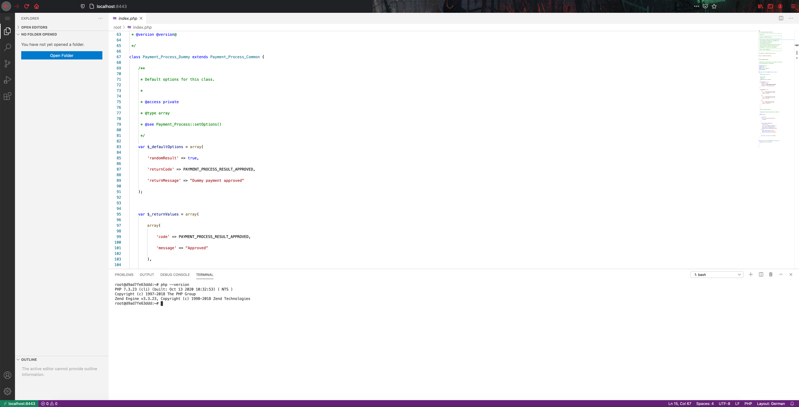

# PHP Cloud Development Environment

This is a PHP development environment inside a docker container, the environment has everything you need to get starting developing php right away.
The container comes with Visual studio code installed already.

## Table of Content

- [PHP Cloud Development Environment](#php-cloud-development-environment)
  - [Table of Content](#table-of-content)
  - [Prerequisite](#prerequisite)
    - [Docker login](#docker-login)
      - [Generate new Personal Access Token](#generate-new-personal-access-token)
      - [Docker Login](#docker-login-1)
  - [Get started](#get-started)
    - [Quick start](#quick-start)
      - [Clone this repository](#clone-this-repository)
      - [Start containers using docker compose](#start-containers-using-docker-compose)
    - [Image](#image)
      - [Downloading pre-built image](#downloading-pre-built-image)
      - [Building your own image](#building-your-own-image)
    - [Docker-compose](#docker-compose)
    - [PHP Server](#php-server)

## Prerequisite

You need to have Docker and docker-compose installed on your system. 
If you do wish to use the pre-built image, you have to do a docker login. Here is a quick guide on how to do so

### Docker login

You need to perform two steps to do a docker login.

#### Generate new Personal Access Token

1. Navigate to [Personal Access Token Page](https://github.com/settings/tokens) on Github.

1. Press Generate new token

1. Make sure you select __Write and Read__ packages on github.

1. Press Generate token.

1. Copy the token and Enable SSO

#### Docker Login

1. Head back to your terminal and type following

		docker login --username <USERNAME> --password <PERSONAL_ACCESS_TOKEN> docker.pkg.github.com

1. Enter your Github username ( if you dont know your usename, head to [Github](https://github.com/) and click on your avatar it is on the top right corner next to a plus sign. A drop down will appear and the first thing it says is "Signed in as <USERNAME>")

1. Enter your personal access token as password.

## Get started

The easiest way to get started is to create a docker-compose.yaml
You will need to the following in your compose file.

- The image to start the container.
- The ports that needs to be exposed to your host machine.
- Environment variables.
  - Password for authencitation.
  - Port for which VS-code should use.
- [OPTIONAL] container name


### Quick start

You can quickly get started by

#### Clone this repository

      git clone https://github.com/ZobairQ/php-cloud-dev-environment.git

#### Start containers using docker compose

  if you need navigate to the `/docker-compose/` directory and then execute

       docker-compose up

### Image

You can either build your own image from the Dockerfile that is included or you can download the images that has already been built.

#### Downloading pre-built image

If you want to use the pre-built image you can just download it by running following command

    docker pull docker.pkg.github.com/zobairq/php-cloud-dev-environment/php-cloud-dev-environment:0.1

Please note if you wish download the pre-built image off github packages you will need to do a docker login otherwise it will not pull anything from github packages. Please refer to [Docker login](#docker-login)

#### Building your own image

If you wish to build the image yourself, you can do it using the Dockerfile.

First you need to clone this repository and change your directory to into the repo.

    git clone https://github.com/ZobairQ/php-cloud-dev-environment.git && cd php-cloud-dev-environment

then you build the building by running following command

    docker build -t php-dev .

This will build and name the image to `php-dev`

### Docker-compose

You can create a file called `docker-compose.yaml` if you need to fresh this subject up, please take a look at my [docker-compose cheat-sheet](https://github.com/ZobairQ/docker-compose-cheat-sheet)

Here is a sample that you can use to get started quickly:

```yaml
version: "3.8"

services:
  dev-environment:
    image: docker.pkg.github.com/zobairq/php-cloud-dev-environment/php-cloud-dev-environment:0.1
    ports:
      - 8443:8443
      - 8081:80
    container_name: php-dev
    environment:
      - PASSWORD=password
      - PORT=8443
```

For the environment variables:
You can change password to something more secure
and if you change the port from 8443 to anything, remember to change the ports that are being exposed (under ports) as well.

Port 80 is exposed to 8081, and this is used for the php server that you can start.

### PHP Server

Once you got the container started and loggin inside vs-code. Create your php project and once you are ready, then open the terminal inside VS-code and run the following commnad to start the php-server

    php -S 0.0.0.0:80

This will now start a PHP server on port 80 which is ported to 8081 in your docker-compose.yaml.
If you want to forward this port to any other port on the host you have to change that in the docker-compose file. For instance I want to port it to `9090` I will need to change the `docker-compose.yml` as follows.

```yaml
version: "3.8"

services:
  dev-environment:
    image: docker.pkg.github.com/zobairq/php-cloud-dev-environment/php-cloud-dev-environment:0.1
    ports:
      - 8443:8443
      - 9090:80
    container_name: php-dev
    environment:
      - PASSWORD=password
      - PORT=8443
```
